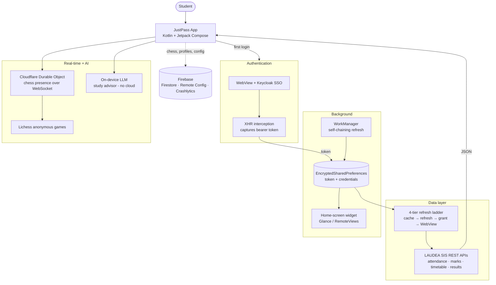

<div align="center">

# 🎓 JustPass

### PSG iTech Attendance — reimagined as a fast, native Android app + home-screen widget

*"Bro enakku topper venam… just pass podhum da."*

A native Android client for the PSG iTech **LAUDEA** Student Information System — attendance, timetable, CA marks, results, and more — wrapped in an iOS-inspired **liquid-glass** UI, with real-time chess, mini-games, and a fully **on-device** AI study advisor.


</div>

---

## 📖 Table of Contents

- [Why it exists](#-why-it-exists)
- [Architecture at a glance](#-architecture-at-a-glance)
- [Features](#-features)
- [Tech stack](#-tech-stack)
- [Engineering highlights](#-engineering-highlights)
- [Building](#-building)
- [Project structure](#-project-structure)
- [Development log](#-development-log)

---

## 💡 Why it exists

The official **LAUDEA SIS** portal is slow and desktop-oriented — logging in just to check whether you're above 75% attendance is a chore. JustPass turns that into a one-tap glance from your home screen, then keeps growing into a full academic companion: it calculates your CGPA, tells you exactly how many classes you can safely skip, finds your exam seat, and even lets you play a quick game of chess with a classmate between lectures.

It reaches students two ways — the **Google Play Store** and students **sharing the APK directly** with friends — a distribution reality that shaped a lot of the engineering decisions in this repo.

---

## 🏗 Architecture at a glance



**In plain English:** the app logs in through an embedded browser, quietly captures the security token the portal's own JavaScript uses, and caches it encrypted on the device. From then on it talks to the college APIs directly over fast HTTP, climbing a ladder of fallbacks if a token expires. A background job keeps the home-screen widget fresh without it ever touching the network. Real-time chess presence lives on a single stateful edge server, and the AI advisor runs entirely on the phone.

---

## ✨ Features

### 📊 Academics
| Feature | What it does |
|---|---|
| **Attendance Dashboard** | Overall % (with/without exemption), present/absent counts, configurable target (default 75%) |
| **Subject-wise Attendance** | Per-subject breakdown with color-coded bars; tap for a day-by-day session timeline |
| **Leave Calculator** | *"What if I skip tomorrow?"* simulator, integrated with the holiday calendar to count real working days |
| **CA Marks** | Continuous-assessment marks with color-coded, expandable breakdowns |
| **Semester Results** | Grades, grade points, and SGPA per semester via tabs |
| **GPA / CGPA Calculator** | R2021 + R2025 curricula, auto department detection, elective picker, OCR grade import via camera |
| **Timetable** | Daily schedule, live **NOW** badge, period-progress overlay, auto-detected honours courses |
| **Exemptions** | All exemption applications with live status tracking |

### ♟ Social & fun
| Feature | What it does |
|---|---|
| **Chess Lobby** | Real-time matchmaking with classmates over a Cloudflare edge backend + Lichess; bullet → classical time controls, ratings, leaderboard, match history |
| **Mini-Games** | Reflex/memory games with a section leaderboard and rival HUD |
| **On-Device AI Advisor** | A local LLM answers *"can I skip Friday and stay above 75%?"* — all math done in Kotlin, phrasing done on-device, **zero cloud calls** |
| **Easter eggs** | Because a survival-themed student app should have a sense of humour |

### 🧰 Utilities
| Feature | What it does |
|---|---|
| **College Circulars** | In-app PDF viewer with pinch-to-zoom |
| **Academic Calendar** | Color-coded events + day-before holiday notifications |
| **Exam Seat Finder** | Import an Excel seating chart via share intent / file picker |
| **Offline Syllabus** | Bundled R2021 + R2025 syllabus with search |
| **Profile** | SIS profile picture, biodata, APK sharing, in-app bug reports |

### ⚙️ System
- **Home-screen widget** — quick attendance glance, auto-refreshing in the background
- **4-tier auto-refresh** — cached token → offline refresh → password grant → WebView fallback
- **Push notifications** — new circulars, upcoming holidays, app updates
- **Pull-to-refresh** — comet-light animation tracing the glass header border

<details>
<summary><b>🎨 About the Liquid-Glass UI</b></summary>

<br/>

An iOS-style frosted-glass design powered by [FletchMcKee/liquid](https://github.com/FletchMcKee/liquid):

- GPU-accelerated glass via real **AGSL shaders** — refraction, edge reflections, chromatic dispersion
- Floating bottom nav with a center bump for Chess and a pill-to-circle morph animation
- Custom animated icons for all five tabs (Home, CA Marks, Chess, GPA, Timetable)
- Crossfade transitions (200 ms) between screens; dark/light glass color schemes
- The widget stays dark and opaque on purpose — home-screen widgets use **RemoteViews**, which can't run GPU shaders

</details>

---

## 🧱 Tech stack

| Layer | Technology |
|---|---|
| **Language** | Kotlin 2.3.0 |
| **UI** | Jetpack Compose + Material 3 (BOM 2025.10.00) |
| **Glass effects** | [FletchMcKee/liquid](https://github.com/FletchMcKee/liquid) 1.1.1 (AGSL shaders) |
| **Widget** | Jetpack Glance / RemoteViews |
| **Auth** | WebView-based Keycloak SSO + XHR token interception |
| **Networking** | Direct HTTP with bearer tokens; parallel coroutine fetches |
| **Storage** | EncryptedSharedPreferences (tokens/credentials) |
| **Background** | WorkManager (self-chaining refresh, notification workers) |
| **Real-time backend** | Cloudflare Workers · Durable Objects · D1 (edge SQLite) |
| **Mobile backend** | Firebase — Firestore, Remote Config, Crashlytics, Cloud Storage |
| **On-device AI** | LiteRT-LM / llama.cpp running small Gemma/Qwen models |
| **Chess engine** | Lichess.org public API (anonymous, no signup) |
| **Leaderboards** | Supabase (Postgres) |
| **OCR** | ML Kit Text Recognition |
| **Build** | AGP 8.13.2 · minSdk 26 (Android 8.0) · target/compile SDK 36 · R8 minification |

---

## 🔬 Engineering highlights

The interesting problems behind the feature list — each is written up in full in the [**Development Log**](DEVELOPMENT_LOG.md):

- **No official API?** Drove a real browser session and read the network calls the portal's own JavaScript made, then hooked `XMLHttpRequest.prototype` inside a WebView to capture the bearer token — instead of reverse-engineering endpoints that kept changing.
- **A 4-tier auth ladder** that degrades gracefully: cached token → refresh-token exchange → password grant → full WebView login, so no single server-side policy change can lock users out.
- **Made a slow backend feel fast** — benchmarking showed firing independent API calls *in parallel* cut load time 75%, while swapping HTTP libraries made it *slower*; the bottleneck was the server, not connection setup.
- **A production-only chess bug** where Cloudflare's WebSocket **Hibernation** wiped in-memory presence state — fixed by rebuilding state from each socket's attached metadata on wake.
- **On-device AI that's actually reliable** — all arithmetic done in Kotlin, only final numbers handed to the LLM to phrase; prompt shrunk from ~500 to ~30 tokens via intent classification, which beat every engine optimization combined.
- **A glass-shader rendering trap** — a Canvas animation placed as a sibling of a blur-shader component smeared across the whole screen, because the shader captured it as backdrop; fixed by drawing into the existing layout's own draw scope.

---

## 🛠 Building

**Requirements**
- Android Studio (latest stable)
- JDK 17+ · Kotlin 2.3.0 · Compose BOM 2025.10.00

**Steps**
```bash
git clone https://github.com/Tarunswamy-Muralidharan/-AttendanceWidgetLaudea.git
cd -AttendanceWidgetLaudea
# open in Android Studio, let Gradle sync, then Run
```

> **Release builds** use R8 minification. ProGuard keep-rules are pre-configured for Gson models, the `@JavascriptInterface` bridge, and Keycloak token handling — the classes reached via reflection that R8 would otherwise strip. Always test a **release** build before publishing; several bugs only appear once R8 runs.

---

## 📂 Project structure

```
app/src/main/
├── java/com/justpass/app/
│   ├── auth/            # WebView login, XHR interception, 4-tier token refresh
│   ├── data/            # API clients, repositories, models (Gson)
│   ├── ui/              # Compose screens, liquid-glass components, animations
│   ├── widget/          # Glance / RemoteViews home-screen widget
│   ├── work/            # WorkManager refresh + notification workers
│   └── ai/              # On-device LLM advisor (intent routing + inference)
├── res/                 # Drawables, weather art, easter-egg assets
└── assets/              # Bundled R2021/R2025 syllabus JSON
chess-lobby/             # Cloudflare Worker + Durable Object (chess presence)
DEVELOPMENT_LOG.md       # Full engineering journal (interview-ready)
```

---

## 📓 Development log

The complete build story — every hard bug, root cause, fix, and lesson — lives in **[DEVELOPMENT_LOG.md](DEVELOPMENT_LOG.md)**, written to be readable start-to-finish and to double as interview prep. The original raw journal is preserved verbatim in `DEVELOPMENT_LOG_ARCHIVE.md`.

---

<div align="center">

**Built by Tarunswamy Muralidharan** · Found a bug? [Open an issue](../../issues/new/choose)

</div>
